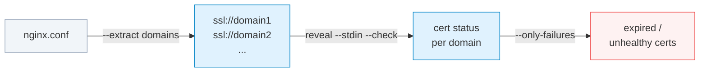

# Your Project Has an API Now

**One syntax. 22 adapters. Code, infrastructure, databases, sessions, and docs — all queryable, all composable.**

---

Look at these five commands:

```bash
reveal 'ast://src/?complexity>15'
reveal ssl://api.example.com --check
reveal diff://git://main/.:git://HEAD/.
reveal sqlite:///app.db/users
reveal 'claude://sessions/?search=auth&since=2026-03-01'
```

Five completely different domains. Code structure. TLS certificates. Structural diffs. Database schemas. AI session history. Same syntax. Same progressive disclosure. Same pipeline composability.

These aren't five different tools. They're five queries against the same data layer.

Your project is a database. You just couldn't query it.

Reveal is the query language.

---

## The syntax

Every adapter follows the same pattern:

```
reveal <adapter>://<target>[/<path>][?<query>]
```

The target changes. The adapter changes. The query operators — filters, format flags, depth controls — work the same everywhere. Once you know how to query code structure, you already know how to query SSL certificates.

```bash
# Code: functions over complexity 10
reveal 'ast://src/?complexity>10'

# Infrastructure: cert expiring within 30 days
reveal ssl://example.com --check --expiring-within=30

# Database: table structure
reveal sqlite:///prod.db/orders

# Docs: articles missing metadata
reveal 'markdown://docs/?!topics'

# Sessions: find where you worked on auth
reveal 'claude://sessions/?search=authentication'
```

The operators are consistent. `--check` means health check. `--format=json` means machine-readable output. `--only-failures` filters to what's broken. Learn them once.

---

## The code cluster

The adapters developers reach for first: `ast://`, `calls://`, `diff://`, `stats://`, `imports://`.

They're designed to work together because code questions are rarely isolated:

```bash
# What changed in this PR? (structural diff)
reveal diff://git://main/.:git://HEAD/.

# Who's affected by what changed? (blast radius)
reveal 'calls://src/?target=validate_payment'

# Is the changed function now too complex? (quality signal)
reveal 'ast://src/payments.py?complexity>10'

# Did this PR introduce circular imports? (dependency health)
reveal 'imports://src/?circular'
```

That's four questions, four commands, a complete picture of a PR before you've read a line of code.

The composed version does all of it in one:

```bash
reveal review main..HEAD
```

`reveal review` runs structural diff → quality checks → hotspot detection → complexity delta, under consistent exit codes. It's what you'd build if you were piping these together manually — automated.

---

## Infrastructure as queryable data

The same syntax that queries your code queries your infrastructure.

```bash
# SSL certificate health
reveal ssl://api.example.com
reveal ssl://api.example.com --check   # exit 0 healthy, 1 warning, 2 critical

# What domains does this nginx config serve?
reveal /etc/nginx/nginx.conf

# nginx configuration issues (ACME paths, timeout mismatches, missing headers)
reveal /etc/nginx/nginx.conf --check

# Domain registration + DNS health
reveal domain://example.com
```

The output follows the same progressive disclosure model as code: overview first, drill down for details, machine-readable JSON for automation.

```bash
# Full cert details
reveal ssl://example.com/chain     # cert chain
reveal ssl://example.com/san       # all covered domains
```

This is where the syntax unification pays off for AI agents. An agent auditing infrastructure doesn't need to learn a new tool for SSL certs, another for nginx, another for DNS. It's the same commands it already uses for code.

---

## The pipeline

Here's the thing nobody expects: Reveal pipes into itself. This isn't output piping — it's dataflow over typed queries.

```bash
# Extract every domain from nginx config, then check each cert
reveal /etc/nginx/nginx.conf --extract domains | reveal --stdin --check
```

The output of one adapter becomes the input of the next. The `--extract domains` flag on the nginx adapter emits `ssl://` URIs. `reveal --stdin --check` reads URIs from stdin and runs health checks on all of them.



More:

```bash
# Show only failures
reveal /etc/nginx/nginx.conf --extract domains | \
  reveal --stdin --check --only-failures

# JSON output filtered by jq
reveal /etc/nginx/nginx.conf --extract domains | \
  reveal --stdin --format=json | \
  jq 'select(.status.health != "healthy")'

# cPanel: get all domains, check their live certs, filter failures
reveal cpanel://USERNAME/domains --format=json | \
  jq -r '.domains[].domain' | \
  sed 's/^/ssl:\/\//' | \
  reveal --stdin --check --only-failures
```

This is a Unix pipeline, not a GUI audit tool. You compose adapters the same way you compose shell commands — but data at each stage is structured and typed, not text.

---

## Everything else — same pattern

Four more domains, same syntax.

**Databases as schemas**

```bash
reveal sqlite:///dev.db/users                              # table structure
reveal mysql://localhost/performance                        # query metrics
reveal diff://sqlite://./dev.db:sqlite://./prod.db         # schema drift between environments
```

**JSON as a navigable tree**

```bash
reveal json://package.json?schema         # infer structure (~100 tokens vs ~5,000 to read)
reveal json://config.json/database/host   # navigate to a key directly
reveal json://tsconfig.json?flatten       # grep-able flat output
```

**Docs as a database**

```bash
reveal 'markdown://docs/?status=draft'             # find drafts
reveal 'markdown://docs/?topics=authentication'    # by topic
reveal 'markdown://docs/?body-contains=oauth'      # full-text search
reveal 'markdown://docs/?aggregate=status'         # frequency table across all docs
reveal 'markdown://docs/?link-graph'               # find orphaned docs
```

**Sessions as history**

```bash
reveal 'claude://sessions/?search=authentication'  # find past work on a topic
reveal 'claude://files/src/auth.py'                # which sessions touched this file?
reveal 'claude://my-session?workflow'              # tool call sequence, collapsed
reveal 'claude://my-session?last'                  # fast session recovery (~50 tokens)
```

`git log` shows what code changed. `claude://files/` shows which AI sessions changed it and why — a layer of provenance git doesn't have.

---

## The token math

For AI agents, the syntax unification has a concrete cost implication.

Reading files is expensive. A 300-line Python file costs ~7,500 tokens to `cat`. A 1,000-line nginx config costs ~25,000. An API response JSON might be 50,000. An entire session history is millions.

The query approach changes the unit of consumption:

| Operation | Approximate tokens |
|-----------|-------------------|
| `cat` a 300-line Python file | ~7,500 |
| `reveal ast://src/module.py` | ~200 |
| `reveal ssl://example.com` | ~150 |
| `reveal json://config.json?schema` | ~100 |
| `reveal 'claude://session?last'` | ~50 |

An agent that queries instead of reads can cover more ground with the same context budget — and get more directly actionable answers. The question "which functions in this codebase are over complexity 15?" costs 200 tokens to answer with `ast://`. It costs 75,000 tokens if the agent reads every file first.

---

## What this actually is

Reveal is not a better grep.

Grep is a text search. It finds occurrences of strings in files. What you get back is lines of text, which you then parse mentally.

Reveal is a query layer. It understands the *semantics* of what it's reading — function signatures, call relationships, certificate chains, nginx upstream configs, frontmatter schemas — and answers questions about them directly.

The same way a database doesn't make you grep through CSV files, Reveal doesn't make you grep through source files. You write a query. You get a typed, structured answer.

Your project — the code, the infrastructure it runs on, the databases it reads, the docs that describe it, the sessions where it was built — is structured data. It was always structured data. You just didn't have a query language for it.

22 adapters today. More coming. Same syntax.

```bash
pip install reveal-cli

reveal help://               # full adapter list
reveal help://relationships  # adapter ecosystem map + power pairs
```

You don't explore your project anymore. You query it.

---

*Part of the Reveal documentation series. See also:*
- *[The Diff That Shows What Actually Changed](/articles/reveal-diff) — structural diffs for code review and CI*
- *[Stop Scrolling. Start Navigating.](/articles/reveal-nav-flags) — four commands for understanding complex functions*
- *[Find Every Caller in Your Codebase With One Command](/articles/reveal-call-graphs) — impact analysis before refactoring*
- *[Two Commands That Change How You Work With Code](/articles/reveal-pack-and-review) — pack and review*
