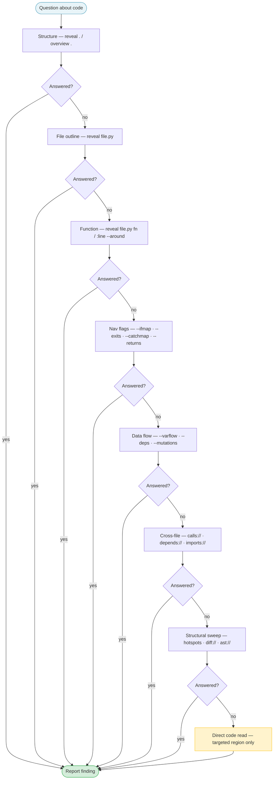

# Agents That Don't Read Everything

**Progressive disclosure for Claude subagents, with two production patterns**

---

Here's a code review agent doing its job:

```
User: "Review this PR before I merge"
Agent: reads auth.py (2,400 lines)
Agent: reads config.py (800 lines)
Agent: reads models.py (1,200 lines)
Agent: reads utils.py (600 lines)
Agent: "The code looks good! Authentication uses JWT tokens and follows
        standard patterns. Consider adding more tests. Overall the PR
        looks solid."
```

It read everything. It learned almost nothing. Eighteen thousand tokens spent on four files to produce one paragraph of confident-sounding nothing.

There's a different approach. Here's the same PR reviewed by an agent that uses `reveal` — a structural code-intelligence CLI that surfaces summaries, call graphs, diffs, and branch maps without requiring the agent to read full files:

```
Agent: reveal review main..HEAD --select B,S,I,C,M
       → changed: validate_token (complexity +8, now 23)
       → B001: bare except at L89

Agent: reveal src/auth.py validate_token --ifmap
       → 7 branches, including one that always returns None

Agent: reveal 'calls://src?target=validate_token'
       → 14 callers across 6 files

Finding: validate_token gained 8 complexity points and now has a branch
that always returns None (L203-211). 14 callers depend on this function.
The bare except at L89 swallows all exceptions silently.
Confidence: high. Evidence: structural diff + call count + branch map.
```

Three tool calls. 800 tokens. Two specific findings with file and line references.

Same model. Same task. Different architecture.

**Most agent failures aren't model failures. They're information architecture failures.** The agent that produced confident-sounding nothing wasn't underpowered — it was over-fed. Agents fail from reading too much, not too little.

This article is about the architecture that fixes it: progressive disclosure as a discipline, baked into the agent at the design level. Two production agents to make it concrete. Four principles you can lift into your own.

---

## Why most analysis agents produce mediocre output

The naive approach to building a code review agent is: give it access to Bash and tell it to "review the code." It will read files. It will produce output. The output will be generic.

There are three failure modes at work.

**Token drowning.** A 2,400-line file is 7,500 tokens. An agent reviewing a moderate codebase exhausts its context window reading files that are mostly irrelevant to what changed. By the time it gets to its analysis, 80% of the context is noise.

**No escalation discipline.** Reading a full file when a structural summary would answer the question is like reading a book when you need the index. The agent doesn't know to stop — it has no protocol for "structure first, implementation only when required."

**Generic output from generic input.** If you feed an agent 18,000 tokens of raw code and ask for a review, the LLM will pattern-match on "this looks like a code review" and produce a code-review-shaped paragraph. You won't get specific findings. You'll get a summary of what the code does.

Progressive disclosure solves all three. But you have to design the agent to use it.

---

## "Why not just use a bigger context window?"

A reasonable reflex. Modern models offer 200K, 1M, even 2M token windows. If the problem is that agents run out of context reading files, just give them more context.

This doesn't solve the problem.

**More context isn't better understanding.** When 80% of the input is irrelevant, the LLM still has to process all of it. Reasoning quality degrades with noise — even when there's room for more. Agents with bloated context produce bloated output: longer paragraphs, more confident claims, fewer specific findings.

**More context is more cost and more latency.** A 200K-token review costs proportionally more than an 8K-token review and takes longer to produce. If your CI runs an agent on every PR, the slow agent is the bottleneck.

**More context defers the problem, doesn't fix it.** Codebases grow. Today's 200K window is tomorrow's "I need 1M." The structural answer — read only what matters — scales without limit. The brute-force answer scales until the next codebase comes along.

Progressive disclosure isn't an optimization on top of LLM intelligence. It's the architecture that lets the intelligence find what matters.

---

## The design: two production agents

We run two reveal-powered agents in production at SIL. Both do code analysis. Both use the same underlying principle. Their designs are deliberately different.

Here's `reveal-codereview`:

```markdown
---
name: reveal-codereview
description: Structural code review using the reveal tool. Proactively use
  for PR reviews, pre-merge checks, code quality audits, complexity analysis,
  import health, dead code detection, and quality hotspots. Use when asked
  to review code, check a PR, audit a module, or assess code quality.
  Requires reveal to be installed.
tools: Bash, Read, Glob, Grep
model: sonnet
maxTurns: 30
color: blue
---
```

And `reveal-investigator`:

```markdown
---
name: reveal-investigator
description: Bug investigation and risk-based code review using reveal for
  token-efficient structural analysis. Proactively use for: bug reports,
  stack traces, failing tests, regressions (investigation mode); or broad
  risk sweeps like "find likely bugs", "what should I worry about", "what
  changed risk-wise" (review mode). Distinct from reveal-codereview which
  handles PR/quality metrics — this agent focuses on bugs, risks, and
  suspicious behavior. Requires reveal to be installed.
tools: Bash, Read, Grep, Glob
model: sonnet
maxTurns: 30
color: red
---
```

These are `.md` files stored in `~/.claude/agents/`. The `description` field is the agent's interface to the orchestrating model. The body is the system prompt. Two agents, one architectural pattern:

| | reveal-codereview | reveal-investigator |
|---|---|---|
| **Trigger** | "review this PR", "audit this module" | "find the bug", "what should I worry about" |
| **Mode** | single workflow (quality scan) | investigation or review, agent selects |
| **Output** | VERDICT + Blocking / Warnings / Observations | Finding + Evidence + Mechanism + Confidence |
| **Failure avoided** | generic summary, missed complexity spikes | reading everything before forming a hypothesis |

Four principles make them work.

---

## Principle 1: Constrain the agent

Both agents have `tools: Bash, Read, Grep, Glob`. Neither has `Edit` or `Write`.

This is intentional. An analysis agent has no business modifying files. Removing `Edit` and `Write` isn't a limitation — it's a declaration: *this agent observes, it doesn't change.*

Tool restriction prevents a common failure mode: an agent that "helpfully" refactors code while reviewing it, mixing analysis with modification. The tool list makes that impossible. The agent's scope is bounded at the architectural level, not by instruction.

The principle generalizes. Every agent should have the minimum tool surface needed to do its job. A research agent doesn't need `Edit`. A documentation agent doesn't need `Bash`. Start with no tools, add only what's required.

`maxTurns: 30` does the same job for time. An unbounded analysis agent on a large codebase will run until it runs out of context. The ceiling is a safety belt, not a target.

The `description` field is part of the constraint too. Both agents include the word "proactively" — a useful signal for delegation. When the orchestrating model matches a task to an agent description, it can delegate automatically rather than waiting for explicit instruction. Write the description like a job posting: specific trigger phrases, clear scope, stated preconditions. Vague descriptions produce vague delegation behavior.

---

## Principle 2: Force escalation discipline

This is the centerpiece. Without it, none of the other principles save you.

**The Escalation Ladder Pattern:**



The investigator's system prompt encodes this as an explicit eight-step order — and the flowchart shows the key rule: **escalate only when the current level doesn't answer the question.** Each "no" costs one cheap tool call; step 8 is reached only after structure, outline, control flow, data flow, and cross-file queries have all been exhausted. By that point the agent knows the directory layout, file outline, function signatures, control flow, data flow, call graph, and import graph. If it still needs the implementation, it's reading a very small, precisely-targeted region — not the whole file.

Compare this to the naive approach: step 8, always, immediately. The naive agent has no ladder, so every question begins by dumping a file into context. It's not stupid — it just has nowhere else to start.

The ladder isn't specific to reveal. The pattern — *cheap structural signals first, expensive raw content last* — applies to any analysis agent. Database agents have it (schema → indexes → query plan → row data). API agents have it (OpenAPI spec → endpoint → request/response). Even document agents have it (table of contents → headings → paragraphs → quote). The escalation ladder is the architectural shape; reveal is one implementation.

---

## Principle 3: Separate operating modes

The investigator handles two distinct tasks: investigating known failures and sweeping for unknown risks. These are different enough that we could have built two separate agents. Instead, we built one with explicit mode selection:

**Investigation** — a concrete failure exists: bug report, stack trace, failing test, regression, suspicious function.

**Review** — no specific failure, find risks: "review this," "find likely bugs," "what should I worry about?"

If both apply, start investigation, widen to review only if needed.

Mode selection isn't documentation. It changes the agent's entire approach. Investigation focuses on one specific fault with supporting evidence. Review sweeps for risks and flags multiple hotspots. Different escalation sequences, different output schemas. One agent, two operating contexts.

The corollary: when modes diverge enough that they need different *tools* or different *escalation ladders*, split into separate agents. That's why `reveal-codereview` exists alongside `reveal-investigator`. PR review and bug hunting share enough surface to live in the same toolkit, but the workflows are different enough that one optimized agent for each beats one super-agent for both. We don't build God functions, and for the same reason we don't build God agents.

---

## Principle 4: Require evidence-bearing outputs

Both agents define exact output schemas. The investigator's:

```
Mode: investigation

Finding: [the concrete bug or strongest suspect]
Evidence: [reveal commands → what they showed]
Mechanism: [how the failure likely happens]
Confidence: high | medium | low
Unverified: [what still needs code reading, tests, or runtime validation]
```

The schema forces honesty. An agent without an output contract can produce a paragraph that sounds authoritative. An agent with one has to say `Confidence: low` and enumerate what it still doesn't know under `Unverified`. The `Evidence` field requires showing the work — which commands ran, what they returned — so findings are verifiable by anyone who can run a shell command. Confident claims with no traceable basis are structurally impossible.

---

## What the agents produce

A representative `reveal-codereview` output (file names anonymized; structure and findings match real PR runs):

```
VERDICT: ⚠️ Concerns

### Warnings
- validate_token (auth.py): complexity 23, up from 15. New branch at L203-211
  always returns None — callers likely assume non-None on success path.
  14 callers via calls://src?target=validate_token.

- parse_config (config.py): complexity 31. Not changed in this PR but
  flagged as hotspot — any caller modification propagates broadly.
  reveal 'calls://src?target=parse_config&depth=2' for transitive impact.

### Observations
- No circular imports introduced (imports://src?circular check clean)
- Dead code: _legacy_auth at L412 is uncalled (added in this PR but
  never called). Public function — flagged.

### Suggested Next Steps
reveal src/auth.py validate_token --returns   # map all exit paths
reveal src/auth.py validate_token --ifmap     # see branch structure
reveal 'calls://src?target=validate_token'    # confirm caller list
```

And `reveal-investigator` on a stack trace (same caveat — representative, not verbatim):

```
Mode: investigation

Finding: SessionManager.refresh() calls validate_token() which returns None
when the token is expired (L208), but refresh() does not check for None —
it calls user.permissions on the return value at L89, producing AttributeError.

Evidence:
  reveal src/auth.py validate_token --returns
    → RETURN L208: return None, gate: token_expired check (L203)
  reveal src/auth.py validate_token --ifmap
    → branch at L203 reaches L208 unconditionally when token_expired
  reveal 'calls://src?target=validate_token'
    → 14 callers; session_manager.py:L89 is one

Mechanism: validate_token returns None on expiry. session_manager calls
  user.permissions on that None at L89. AttributeError in production.

Confidence: high
Unverified: whether other callers also fail to null-check the return value
  (14 callers — worth checking with: grep -n "validate_token" src/)
```

Specific, traceable, honest about what's still unverified. The agent ran three commands. The output is more useful than a 2,000-word summary of what the code does.

---

## The token math

For a typical PR review — 5 changed files, 1 flagged function, 1 dead-code candidate:

| Approach | Tool calls | Tokens used | Output quality |
|----------|-----------|-------------|----------------|
| Naive (read all changed files) | 5 | ~18,000 | Generic summary |
| Reveal-powered agent | 8–12 | ~2,000 | Specific findings with evidence |

The 9x token reduction is almost secondary. The reveal agent produces actionable findings because it uses structure to find what matters, then reads only that. Most investigations never reach step 8 of the ladder — file outline, diff, and one nav flag answer the question at steps 2–4.

---

## Honest limitations

These agents produce structural analysis, not runtime truth.

`calls://` is static. Dynamic dispatch, runtime delegation, and monkey-patching won't appear in the call graph. A function with 14 static callers might have 40 at runtime, or 2.

`reveal review` catches structural complexity and known rule violations. It will not catch a subtle algorithm bug, a race condition, or a logic error that looks structurally clean.

`--sideeffects` and `--boundary` find patterns by name, not by execution. A database call hidden behind a lambda, passed as a callback, or reached through dynamic dispatch won't be classified.

The right framing: these agents find structural risks fast and cheaply. They surface where to look, not everything that's wrong. The `Unverified` field in the output contract is there for a reason — use it.

---

## The larger pattern

Progressive disclosure has always been about structure over noise — giving an agent the minimum information it needs to act correctly, then more only when required.

Subagents extend this pattern from individual tool calls to the agent system itself. The four principles — constrain the agent, force escalation discipline, separate operating modes, require evidence-bearing outputs — are progressive disclosure applied to architecture rather than to a single query.

The reveal agents work because the escalation ladder is their cognitive protocol. Every tool call is a step in a defined sequence. Every finding has traceable evidence. Every output says what's still unverified. The orchestrating model isn't asked to be smart — it's asked to follow the protocol.

This is software design applied to agents. Single responsibility. Explicit interfaces. Bounded side effects. The same principles that make functions maintainable make agents reliable.

The reveal agents don't work because they're clever. They work because they're disciplined.

---

## Resources

**Install reveal:**

```bash
pip install --upgrade reveal-cli
```

- **Agents:** [in our public config](https://github.com/Semantic-Infrastructure-Lab/sil)
- **Reveal commands used:** [reveal introduction](https://semanticinfrastructurelab.org/articles/reveal-introduction)
- **GitHub:** [Semantic-Infrastructure-Lab/reveal](https://github.com/Semantic-Infrastructure-Lab/reveal)
- **PyPI:** [reveal-cli](https://pypi.org/project/reveal-cli/)

*Reveal v0.87.0 — 8,432 tests, 23 URI adapters, 73 quality rules, 190+ languages. MIT license.*
